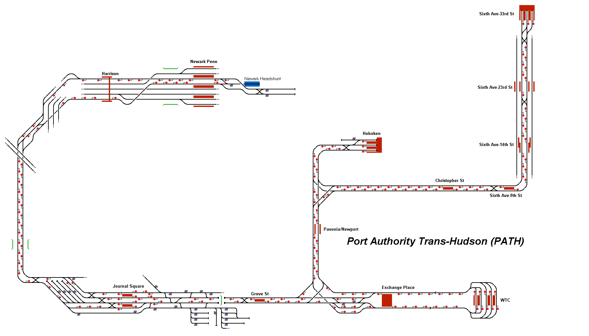

# PATH: Port Authority Trans-Hudson Subway

This route depicts the small subway network that connects New Jersey to the city of New York, USA. The network contains three routes which connect to either Sixth Avenue or World Trade Center (WTC). Included within the route is a simplified timetable based on Monday-Friday services.

## Current Status

| Stage         | Status        |
| ------------- |:-------------:|
| Track Plan     | :heavy_check_mark: |
| Signalling      | :heavy_check_mark:      |
| Naming | :heavy_check_mark:      |
| Speed Limits | :heavy_check_mark: |
| Distances | :heavy_check_mark: |
| Timetable | :heavy_check_mark: |
| Documentation | :heavy_check_mark: |

## Data Sources

- [Map Meurisse](https://map.meurisse.org/)
